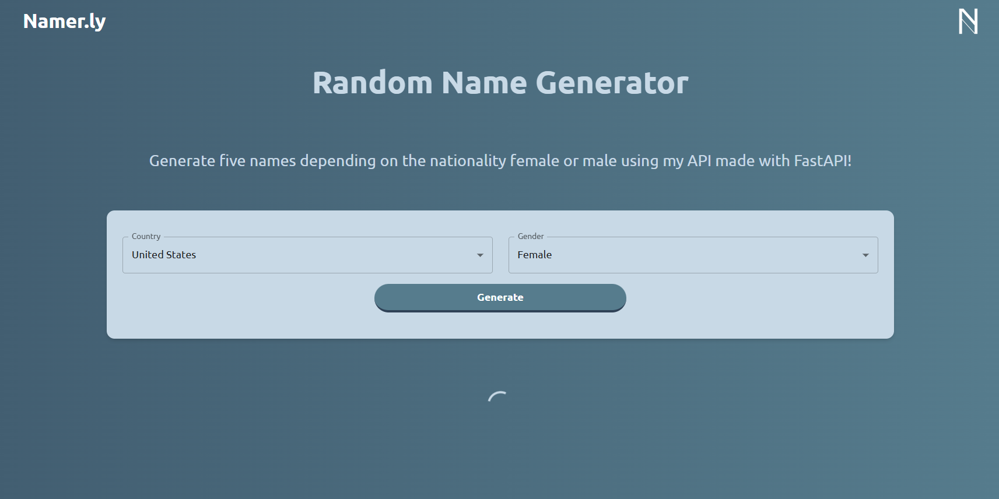
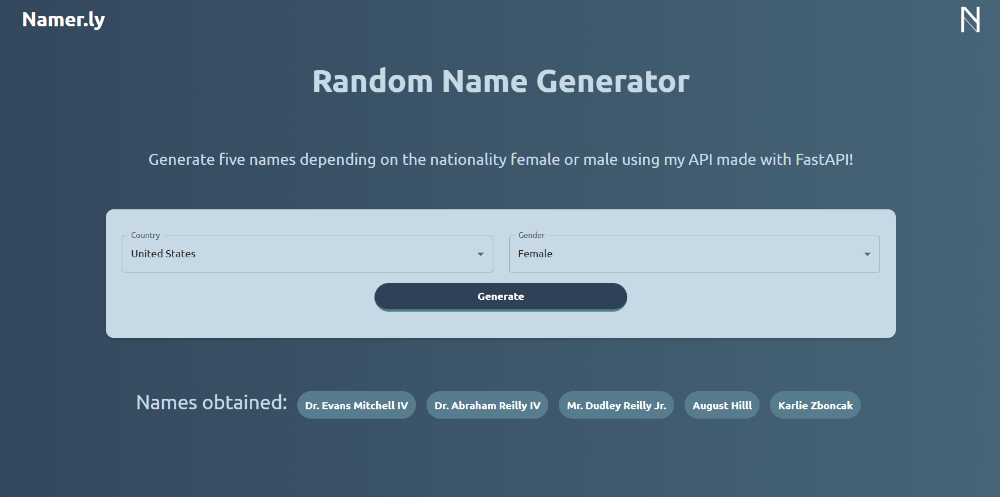

# Namerly - Generador de Nombres Aleatorios

**Namerly** es una aplicación web que te permite generar nombres aleatorios personalizados. Utilizando la potencia de **FastAPI** en el backend, esta herramienta puede generar hasta 5 nombres al mismo tiempo basados en parámetros como nacionalidad, país, y género. Su interfaz, construida con **React** y **Tailwind CSS**, ofrece una experiencia rápida, fluida e intuitiva para que puedas obtener nombres perfectos de manera fácil y rápida.

## 🚀 Descripción del Producto

### ¿Cómo funciona Namerly?

Al abrir la aplicación, **Namerly** te presenta una interfaz sencilla donde puedes generar nombres aleatorios para diferentes propósitos, como proyectos, mascotas o personajes. La aplicación permite personalizar los parámetros, como la nacionalidad, el país y el género, para que los nombres generados se ajusten a tus necesidades específicas.

### 1. **Pantalla de Carga** (Cargando...)

Cuando accedes por primera vez a la aplicación, serás recibido por una pantalla de carga mientras la aplicación procesa los parámetros y genera los nombres solicitados.

### 2. **Pantalla Principal** (Generación de Nombres)

Una vez cargada la página, podrás ver el panel principal, donde podrás seleccionar los parámetros para personalizar los nombres que deseas generar. En esta sección podrás elegir:

- **País**: Puedes especificar un país para el nombre.
- **Género**: Puedes elegir entre masculino, femenino o neutro.

Cuando todo esté listo, puedes hacer clic en el botón para generar los nombres.

### 3. **Generación de Nombres Aleatorios**

Al hacer clic en el botón para generar los nombres, el backend, basado en **FastAPI**, utiliza un algoritmo para crear hasta 5 nombres aleatorios según los parámetros seleccionados. Esta funcionalidad es rápida y permite personalizar la generación de nombres en cuestión de segundos.

### 4. **Interfaz React + Tailwind**

La aplicación cuenta con una interfaz limpia, moderna y completamente responsiva, desarrollada con **React** y **Tailwind CSS**. Esto asegura que la experiencia sea fluida tanto en dispositivos de escritorio como móviles.

## 🛠 Tecnologías Utilizadas

- **Frontend**: [React](https://reactjs.org) + [Tailwind CSS](https://tailwindcss.com) para la construcción de una interfaz interactiva y responsiva.
- **Backend**: [FastAPI](https://fastapi.tiangolo.com) para la generación de nombres aleatorios con alta performance.
- **Deployment**: La aplicación está lista para ser desplegada en cualquier servidor o contenedor Docker.
